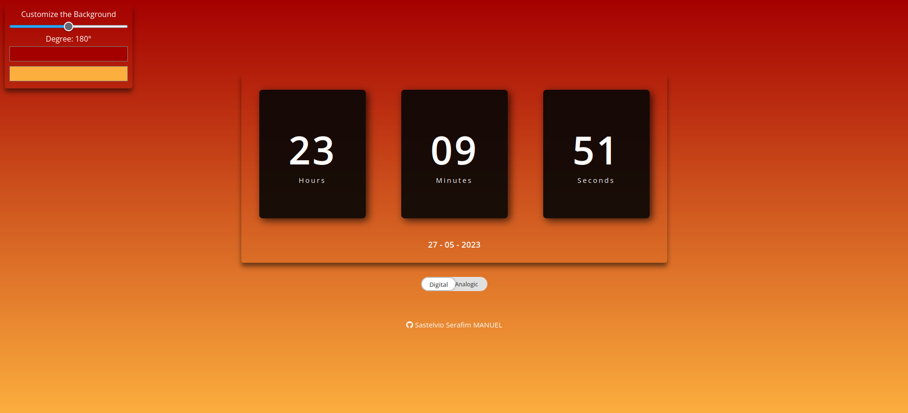
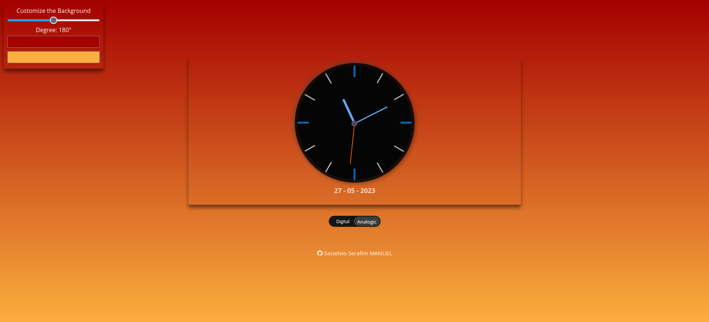

## Project Name

OCLOCK

## Description

A project made using HTML, CSS and JS to show the time in your system. has a background color selector.

## Table of Contents

- [Installation](#installation)
- [Usage](#usage)
- [Demo](#demo)
- [License](#license)

## Usage

Double-click the index.html file

## Demo

### Digital

### Analogic

## License

MIT License

